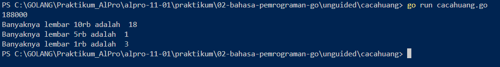
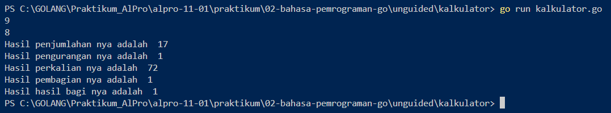

# <h1 align="center">Laporan Praktikum Modul 2 - Bahasa Pemrograman GO</h1>
<p align="center">Osteo Naufal Al Badi - 109092600010</p>

## Dasar Teori

### A. Bahasa Pemrograman GO

Go (atau sering disebut Golang) adalah bahasa pemrograman bersumber terbuka (*open-source*) yang dikembangkan oleh tim di Google pada tahun 2007 dan dirilis secara publik pada tahun 2009. Go dirancang oleh Robert Griesemer, Rob Pike, dan Ken Thompson untuk mengatasi berbagai permasalahan efisiensi dalam pengembangan perangkat lunak berskala besar, seperti kompilasi yang lambat dan kompleksitas manajemen memori. Menurut Donovan & Kernighan (2015), Go menggabungkan efisiensi dan keamanan dari bahasa terkompilasi berstatis (*statically typed*) seperti C/C++ dengan kemudahan penulisan kode (*expressiveness*) khas bahasa dinamis seperti Python.

Beberapa karakteristik utama dari bahasa pemrograman Go antara lain:

1. **Sederhana dan Efisien:** Sintaksis Go dirancang minimalis sehingga mudah dipelajari, namun proses kompilasinya langsung menghasilkan bahasa mesin (*executable binary*) tanpa membutuhkan *virtual machine*.
2. **Statically Typed:** Tipe data setiap variabel diperiksa pada saat kompilasi (*compile-time*), yang membantu meminimalkan potensi kesalahan saat program dijalankan (*runtime*).
3. **Manajemen Memori Otomatis:** Go dilengkapi dengan *Garbage Collector* (GC) otomatis yang mengelola alokasi dan pembebasan memori tanpa memerlukan intervensi manual dari programmer.
4. **Dukungan Konkurensi Native:** Go menyediakan fitur *goroutine* dan *channel* yang memungkinkan eksekusi proses secara paralel dengan penggunaan sumber daya yang sangat ringan.


---

### B. Package dan Struktur Program di Go

#### 1. Pengertian Package main dan func main()

Dalam bahasa pemrograman Go, setiap kode sumber terorganisir ke dalam modul-modul bernama *package*. *Package* berfungsi untuk mengelompokkan kode agar modular dan mudah dikelola.

`package main` merupakan *package* khusus yang menandakan bahwa program tersebut adalah aplikasi yang dapat dieksekusi secara mandiri (*executable program*), bukan sekadar pustaka (*library*). Di dalam `package main`, wajib terdapat fungsi utama yaitu `func main()`. Fungsi `main()` bertindak sebagai titik masuk (*entry point*) pertama kali saat program dijalankan oleh sistem. Tanpa adanya deklarasi `package main` dan fungsi `main()`, program Go tidak dapat dijalankan sebagai file biner mandiri.

#### 2. Tipe Data dan Deklarasi Variabel di Go

Variabel di dalam Go digunakan untuk menyimpan nilai data yang akan diproses selama program berjalan. Karena Go bersifat *statically typed*, setiap variabel memiliki tipe data tertentu yang menentukan jenis nilai yang disimpannya:

* **Tipe Data Dasar:**
* `string`: Menampung kumpulan karakter atau teks (misal: `"Alpro"`).
* `int`: Menampung bilangan bulat, baik positif maupun negatif (misal: `10`, `-5`).
* `float64`: Menampung bilangan desimal/real (misal: `3.14`).


* **Metode Deklarasi Variabel:**
1. **Menggunakan kata kunci `var`:** Menyebutkan tipe data secara eksplisit.
```go
var nama string = "Osteo"
var umur int

```


2. **Short Declaration (`:=`):** Go secara otomatis menetapkan (*infer*) tipe data berdasarkan nilai yang diisikan.
```go
pi := 3.14

```

<!-- Tambahkan poin A, B, C, ... atau sub-topik 1, 2, 3, ... sesuai kebutuhan modul -->

## Guided

### 1. tukar.go

```go
package main

import "fmt"

func main() {
	// Deklarasi variabel
	var r, luas float64

	// Assignment nilai pi
	pi := 3.14

	// Membaca masukan jari-jari lingkaran
	fmt.Scan(&r)

	// Menghitung luas lingkaran
	luas = pi * r * r

	// Menampilkan hasil luas lingkaran
	fmt.Println("Luas lingkaran:", luas)
}
```
#### Deskripsi

Kode program Go di atas berfungsi untuk menghitung luas sebuah lingkaran berdasarkan nilai jari-jari yang diinputkan oleh pengguna.

Program diawali dengan mendeklarasikan variabel `r` dan `luas` bertipe `float64` untuk menampung nilai desimal. Variabel `pi` dideklarasikan dan diinisialisasi secara otomatis (*short declaration*) dengan nilai konstanta $3.14$. Pengguna kemudian memasukkan nilai jari-jari lingkaran ke dalam variabel `r` menggunakan fungsi `fmt.Scan`.

Selanjutnya, program menghitung luas lingkaran menggunakan rumus $L = \pi \times r^2$ (`luas = pi * r * r`). Di akhir program, hasil perhitungan luas lingkaran dicetak ke layar menggunakan fungsi `fmt.Println`.

### 2. skor.go

```go
package main

import "fmt"

func main()  {
	var nama string
	var skorMatematika, skorBahasaInggris int

	//Membaca input
	fmt.Scan(&nama)
	fmt.Scan(&skorBahasaInggris)
	fmt.Scan(&skorMatematika)

	//Menghitung total dan rata-rata (Pembagian bilangan)
	total := skorBahasaInggris + skorMatematika
	rataRata := total/2

	//Menampilkan output
	fmt.Println(nama)
	fmt.Println(total)
	fmt.Println(rataRata)
}
```
#### Deskripsi

Kode program Go di atas berfungsi untuk menghitung nilai total dan rata-rata dari dua mata pelajaran (Bahasa Inggris dan Matematika) untuk seorang siswa.

Program diawali dengan mendeklarasikan variabel `nama` bertipe `string` serta `skorMatematika` dan `skorBahasaInggris` bertipe `int`. Nilai dari ketiga variabel tersebut diinputkan oleh pengguna secara berurutan menggunakan fungsi `fmt.Scan`. Setelah data diterima, program melakukan kalkulasi berikut:

1. **Total Skor (`total`):** Menjumlahkan nilai `skorBahasaInggris` dan `skorMatematika`.
2. **Rata-Rata (`rataRata`):** Menghitung rata-rata dengan membagi variabel `total` dengan nilai $2$ menggunakan pembagian bulat (*integer division*).

Di akhir program, nama siswa, total skor, dan nilai rata-rata dicetak ke layar secara berurutan menggunakan fungsi `fmt.Println`.
### 3. lingkaran.go

```go
package main

import "fmt"

func main() {
	// Deklarasi variabel
	var r, luas float64

	// Assignment nilai pi
	pi := 3.14

	// Membaca masukan jari-jari lingkaran
	fmt.Scan(&r)

	// Menghitung luas lingkaran
	luas = pi * r * r

	// Menampilkan hasil luas lingkaran
	fmt.Println("Luas lingkaran:", luas)
}
```

### 4. suhu.go

```go
package main

import "fmt"

func main() {
	// Deklarasi variabel
	var celsius float64

	// Membaca masukan suhu Celsius
	fmt.Scan(&celsius)

	// Menghitung konversi ke Reamur, Fahrenheit, dan Kelvin
	reamur := celsius * 4.0 / 5.0
	fahrenheit := celsius*9.0/5.0 + 32.0
	kelvin := celsius + 273.15

	// Menampilkan keluaran Reamur, Fahrenheit, dan Kelvin
	fmt.Println("Reamur:", reamur)
	fmt.Println("Fahrenheit:", fahrenheit)
	fmt.Println("Kelvin:", kelvin)
}
```
#### Deskripsi

Kode program Go di atas berfungsi untuk mengonversi nilai suhu dari satuan Celsius ke tiga satuan suhu lainnya, yaitu Reamur, Fahrenheit, dan Kelvin.

Program diawali dengan mendeklarasikan variabel `celsius` bertipe `float64` untuk menampung input suhu berbasis desimal. Pengguna memasukkan nilai suhu Celsius menggunakan fungsi `fmt.Scan`. Selanjutnya, program melakukan kalkulasi konversi suhu sesuai rumus matematis masing-masing:

1. **Reamur (`reamur`):** Dihitung menggunakan rumus $\text{Celsius} \times \frac{4}{5}$.
2. **Fahrenheit (`fahrenheit`):** Dihitung menggunakan rumus $(\text{Celsius} \times \frac{9}{5}) + 32$.
3. **Kelvin (`kelvin`):** Dihitung dengan menambahkan konstanta $273.15$ ke nilai Celsius.

Pada tahap akhir, seluruh hasil konversi suhu (Reamur, Fahrenheit, dan Kelvin) dicetak secara berurutan ke layar menggunakan fungsi `fmt.Println`.

<!-- Tambahkan blok file/kode lain sesuai jumlah file pada soal guided -->

## Unguided

### 1. cacahuang.go

```go
package main

import "fmt"

func main() {
	var uang int

	// Membaca masukan nominal uang
	fmt.Scan(&uang)

	// Menghitung lembar sepuluh ribu (10000)
	sepuluhRibu := uang / 10000
	sisa := uang % 10000

	// Menghitung lembar lima ribu (5000) dari sisa uang
	limaRibu := sisa / 5000
	sisa = sisa % 5000

	// Menghitung lembar seribu (1000) dari sisa uang
	seRibu := sisa / 1000

	// Menampilkan keluaran (banyaknya lembar 10rb, 5rb, dan 1rb)
	fmt.Println("Banyaknya lembar 10rb adalah ", sepuluhRibu)
	fmt.Println("Banyaknya lembar 5rb adalah ", limaRibu)
	fmt.Println("Banyaknya lembar 1rb adalah ", seRibu)
}
```

##### Output
<!-- Path relatif dari readme.md ke folder unguided/[nama_soal]/output.png, contoh: -->



#### Deskripsi
Kode program Go di atas bertujuan untuk menghitung pecahan nominal uang kertas (10.000, 5.000, dan 1.000) dari total nominal uang yang diinputkan oleh pengguna.

Program diawali dengan membaca nilai input integer ke dalam variabel uang menggunakan fmt.Scan. Selanjutnya, proses perhitungan pecahan dilakukan secara sekuensial menggunakan kombinasi operator pembagian (/) dan modulus (%):

1. Pecahan 10.000: Variabel sepuluhRibu dihitung dengan membagi uang dengan 10000. Sisa uang yang belum terbagi disimpan kembali ke dalam variabel sisa menggunakan operasi modulus uang % 10000.

2. Pecahan 5.000: Variabel limaRibu dihitung dari pembagian sisa dengan 5000, lalu nilai sisa diperbarui dengan hasil modulus sisa % 5000.

3. Pecahan 1.000: Variabel seRibu dihitung dengan membagi sisa terakhir dengan 1000.

Di akhir program, hasil perhitungan jumlah lembar dari masing-masing pecahan uang (10rb, 5rb, dan 1rb) dicetak ke layar menggunakan fmt.Println.

### 2. kalkulator.go

```go
package main
import "fmt"

func main()  {
	var a, b int

	fmt.Scan(&a)
	fmt.Scan(&b)

	addition := a + b
	reduction := a - b
	multiplication := a * b
	distribution := a / b
	quotient := a % b

	fmt.Println("Hasil penjumlahan nya adalah ", addition)
	fmt.Println("Hasil pengurangan nya adalah ", reduction)
	fmt.Println("Hasil perkalian nya adalah ", multiplication)
	fmt.Println("Hasil pembagian nya adalah ", distribution)
	fmt.Println("Hasil hasil bagi nya adalah ", quotient)
}
```

##### Output


#### Deskripsi

Kode program Go di atas berfungsi sebagai kalkulator sederhana yang melakukan operasi aritmatika dasar terhadap dua buah bilangan bulat (*integer*).

Program diawali dengan mendeklarasikan dua variabel integer, yaitu `a` dan `b`, yang nilainya diinputkan oleh pengguna secara berurutan menggunakan fungsi `fmt.Scan`. Setelah kedua input diterima, program melakukan beberapa operasi aritmatika dan menyimpannya ke dalam variabel masing-masing:

1. Penjumlahan (`addition`): Menghitung hasil tambah a + b.
2. Pengurangan (`reduction`): Menghitung hasil kurang a - b.
3. Perkalian (`multiplication`): Menghitung hasil kali a * b.
4. Pembagian (`distribution`): Menghitung hasil bagi bulat a / b.
5. Sisa Bagi/Modulus (`quotient`): Menghitung sisa hasil pembagian a % b.

Di akhir program, seluruh hasil operasi aritmatika tersebut dicetak ke layar satu per satu menggunakan fungsi `fmt.Println`.

<!-- Duplikasi blok "### [nama_soal]" sesuai jumlah folder soal di dalam unguided -->


---

### Kesimpulan

Berdasarkan praktikum yang telah dilaksanakan, dapat disimpulkan bahwa tujuan praktikum telah tercapai dengan hasil sebagai berikut:

1. **Pemahaman Struktur Dasar Go:** Praktikan telah memahami dan mampu membuat struktur dasar program menggunakan bahasa Go, yang wajib diawali dengan deklarasi `package main` dan `func main()` sebagai titik awal eksekusi (*entry point*).
2. **Implementasi Variabel dan Tipe Data:** Praktikan berhasil mengimplementasikan penggunaan berbagai tipe data dasar (seperti `int`, `float64`, dan `string`) serta mampu mendeklarasikan variabel dengan tepat, baik secara eksplisit menggunakan `var` maupun menggunakan *short declaration* (`:=`).
3. **Penggunaan Input dan Output:** Program-program yang dibuat telah berhasil mendemonstrasikan proses interaksi dengan pengguna melalui penggunaan fungsi `fmt.Scan` untuk membaca data masukan dan `fmt.Println` untuk mencetak keluaran/hasil ke layar.
4. **Penerapan Operasi Aritmatika dan Logika Sekuensial:** Praktikan mampu menyelesaikan berbagai studi kasus pemrograman dasar (seperti perhitungan pecahan uang, kalkulator, konversi suhu, nilai rata-rata, dan luas lingkaran) dengan menerapkan alur logika berurutan (sekuensial) menggunakan operator aritmatika dasar (`+`, `-`, `*`, `/`, dan `%`).

## Referensi
1. [Nama Penulis]. ([Tahun]). *[Judul Buku/Sumber]*. [Kota]: [Penerbit]. Diakses pada [tanggal akses] melalui [tautan/DOI]
2. [Nama Penulis]. ([Tahun]). *[Judul Buku/Sumber]*. [Kota]: [Penerbit]. Diakses pada [tanggal akses] melalui [tautan/DOI]
<!-- Tambahkan nomor referensi berikutnya sesuai kebutuhan -->
